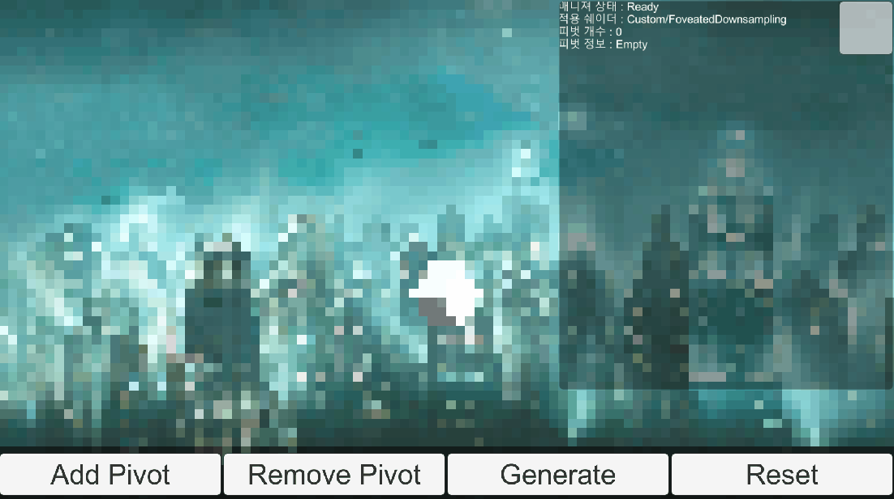

# Foveated-Anisotropic-Shader
Anisotropic Foveated Rendering Shader (Unity 2020.3.20)

연구실 후배를 위한 프로젝트

## 구성

### Debug Window

화면 우측 상단에 위치. 매니저 상태, Pivot 리스트, 개수 등등 확인 가능. 실제 Pivot을 찍을 때, 최상단 좌측의 버튼을 눌러 Off하여 사용을 권장.

### Add Pivot Button

비등방성 경계선을 구성할 Pivot 생성 모드로 진입. Pivot을 꽂을 수 있음 (UI 영역은 제외). **Pivot이 클릭한 순서대로, 비등방성 도형이 구성되기 때문에, 시계 방향이나 반시계 방향으로 Pivot을 찍어야 됨**.

### Remove Pivot Button

Pivot을 삭제할 수 있는 모드. 마우스 클릭 시, 해당 위치의 Pivot을 삭제함.

### Generate Button

구성된 Pivot들을 바탕으로 비등방성 쉐이더를 생성. Pivot이 **3개 이상**이 되어야 생성됨.

### Reset Button

Pivot을 모두 지우고 초기 상태로 돌아감.

## 사용법

1. Add Pivot Button을 눌러, Pivot을 꽂을 상태로 진입합니다.
2. 3개 이상의 Pivot을 꽂아, 비등방성 도형을 구성할 준비를 합니다.
3. 필요하다면 Remove Pivot Button을 눌러, 삭제 상태로 진입합니다. 후에, Pivot GameObject 근방을 눌러, Pivot을 제거합니다.
4. Generate Button을 눌러, 구현된 비등방성 필터링을 확인할 수 있습니다.
5. 초기 화면으로 진입하기 위해, Reset Button을 누릅니다.

